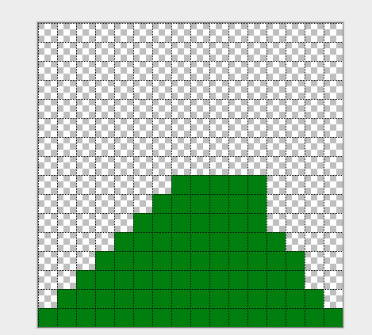

## LESSON 14 - Variable-size hills

You will have noticed by now that hills are pretty easy to run into - even when it looks like you haven't run into them!  This is because our game is checking for the size of the image, which at least for now is always 16x16, when the hill is often much smaller.

One option is to make the images themselves smaller.  Another is to add a proper hitbox to the image so that we know which parts of it actually contain something.

The first thing you'll need to do is figure out where the pixels are in your image.  Unfortunately, unlike a lot of graphics programs, Pinta doesn't have a measure of where the pixels are located, so you'll have to count yourself.  In Pinta, open the View menu and select "pixel grid" so that it's easier.  Then count down from the TOP LEFT - not the bottom - and see how many pixels down and across the hill is.  So for example, say you had a hill like this:



You would count down and find the highest pixel started on pixel 8.  Why 8 and not 9?  Because you start counting from 0, that's why.  And, since the hill starts in the very first pixel on the left, the left-hand size starts at 0.  We write things in x,y coordinates as a rule, so we'll say the start point is 0, 8.  The hill goes all the way to the bottom, and all the way to the left, so the end point is 15,15.  Do this for your own hill and write down the numbers somewhere.

If you want, you can do the same thing for your cat - it probably doesn't take up the whole image either.

### Adding hitboxes to our sprite
Now normally you can have multiple hitboxes, which would mean we'd have to compare every hitbox in our cat to every hitbox in every hill.  But that's a little too complicated for now, so instead let's just give sprites one hitbox.  Let's start by assigning a default value.  Find the Sprite object, and then inside it, find the image.onload function.  Inside THAT, add this line up at the top:

```
        self.hitbox = {
            x1: 0,
            y1: 0,
            x2: self.image.width / self.frameCount - 1,
            y2: self.image.height - 1,
        };
```

This just makes the hitbox the same as one full frame of the sprite.  If you plan on leaving the cat alone and not adding a hitbox, you won't need another one.

However the hill will definitely need a hitbox.  Find the Hill sprite, and then inside it, find the initialize function.  In other words, first find this:

`function Hill() {`

and then a little lower down, inside the block created by the { and } of the Hill, find this:

`    this.initialize = function() {`

Inside of that function, add a new hitbox.  This one will look a little different:

```
        this.hitbox = {
            x1: 0,
            y1: 8,
            x2: 15,
            y2: 15,
        };
```

I'm using the numbers I got for my hill.  You'll need to use the ones you wrote down for your own hill if you want this to work.

Now that we have hitboxes for everything, let's change the isOverlapping function.

The old one looked like this:

```
function isOverlapping(cat, hill) {
    return cat.position.x < hill.position.x + hill.image.width &&
        cat.position.x + 16 > hill.position.x &&
        cat.position.y < hill.position.y + hill.image.height &&
        cat.position.y + 16 > hill.position.y;
}
```

Now we'll change it to use hitboxes.

First, add a new function ABOVE the isOverlapping function:

```
function globalHitbox(sprite) {
    return {
        x1: sprite.position.x + sprite.hitbox.x1,
        y1: sprite.position.y + sprite.hitbox.y1,
        x2: sprite.position.x + sprite.hitbox.x2,
        y2: sprite.position.y + sprite.hitbox.y2
    };
}
```

This will make it easier to compare the two sprites and their hitboxes by doing a bit of the math ahead of time.  It's called a "helper" or "convenience" function.

Now, we'll change the isOverlapping function itself:

```
function isOverlapping(cat, hill) {
    if (!cat || !cat.hitbox || !hill || !hill.hitbox) {
        return false;
    }

    var hb1 = globalHitbox(cat);
    var hb2 = globalHitbox(hill);

    return hb1.x1 <= hb2.x2 &&
        hb1.x2 > hb2.x1 &&
        hb1.y1 <= hb2.y2 &&
        hb1.y2 > hb2.y1;
}
```

If you save, and everything is right, you should notice that you now only get a game over when the cat really runs into the hill!
